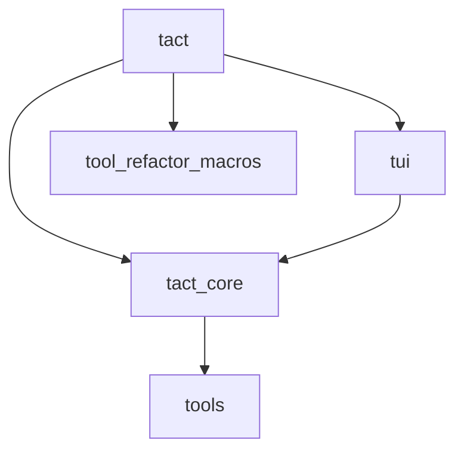
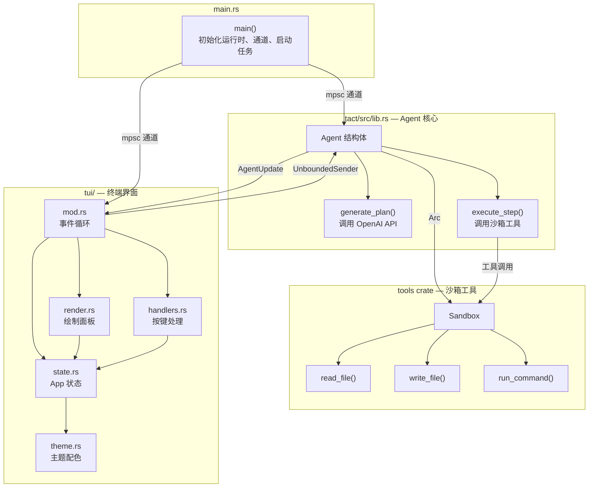
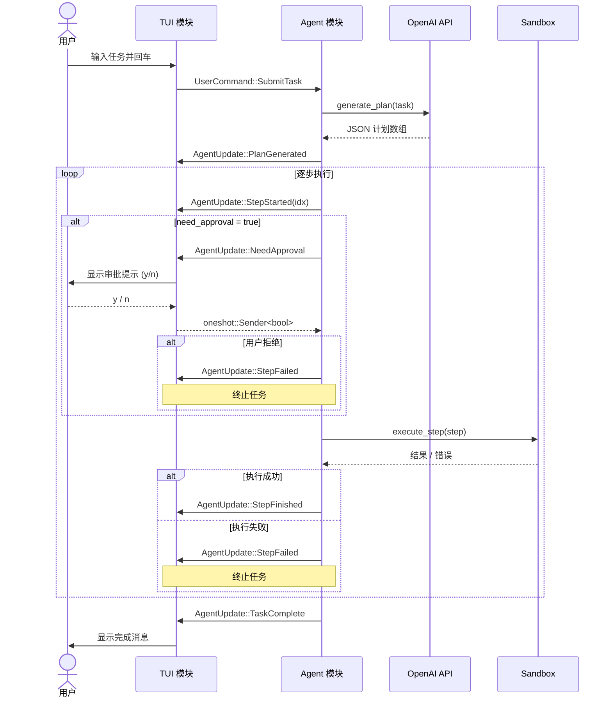
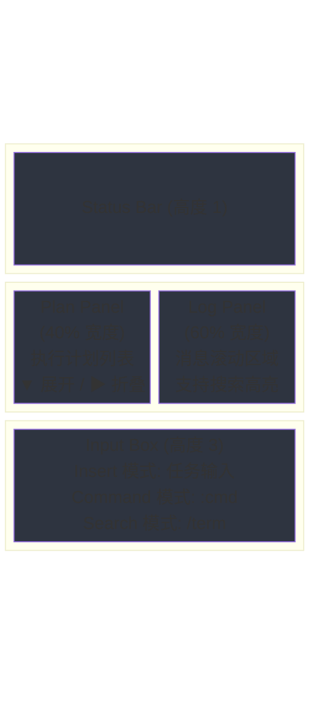
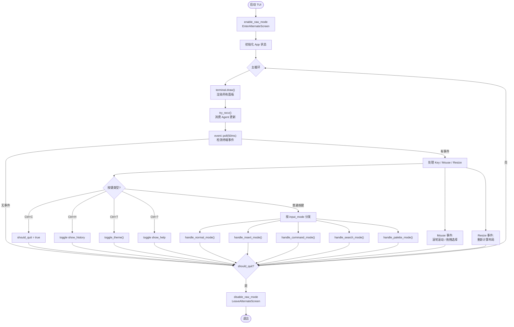
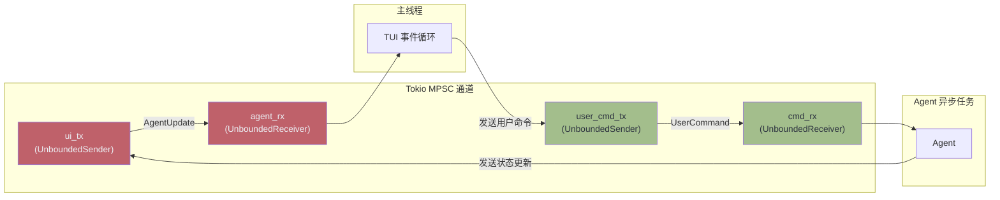
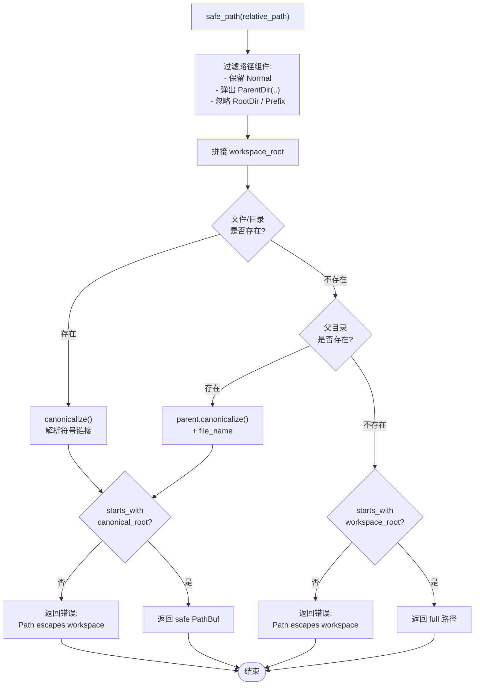

# 架构与流程文档

本文档通过 Mermaid 图表描述 `agent-tui-full` 的整体架构、核心数据流及终端界面布局。

---

## 0. Workspace 结构

本项目是一个 Cargo Workspace，包含以下 crate：

| 目录 | 包名 | 职责 |
|---|---|---|
| `crates/core` | `tact_core` | 共享类型：`AgentUpdate`、`UserCommand`、`PlanStep`、`StepResult`、`StepStatus` |
| `crates/tools` | `tools` | `Sandbox`：文件读写、命令执行的安全封装 |
| `crates/tui` | `tui` | 基于 `ratatui` 的终端交互界面 |
| `crates/tact` | `tact` | Agent runtime、主循环、工具路由、CLI 入口 |
| `crates/tool_refactor_macros` | `tool_refactor_macros` | 工具重构相关的过程宏 |

依赖关系（简图）：

---

## 1. 模块架构图

---

## 2. Agent 任务执行流程图

---

## 3. TUI 渲染布局图

### 覆盖层（弹出面板）

---

## 4. 事件循环流程图

---

## 5. 通道通信架构图

---

## 6. 沙箱安全路径处理流程

