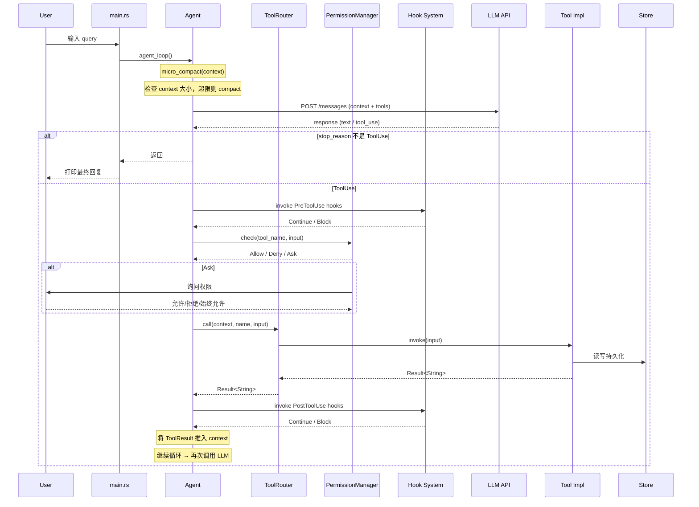

# sfull Architecture

```mermaid
graph TB
    %% ── 入口层 ──
    Main(["main.rs<br/>REPL Loop"])

    %% ── 核心结构 ──
    subgraph Core["Agent Core"]
        Agent["Agent"]
        Runtime["AgentRuntime<br/>client / context / compact_state / recovery_state"]
        ToolContext["ToolContext<br/>共享状态容器"]
    end

    %% ── 工具路由 ──
    subgraph Tools["Tool Dispatch"]
        Router["ToolRouter<br/>30+ local tools"]
        McpRouter["MCPToolRouter<br/>mcp__server__tool"]
    end

    %% ── 生命周期 ──
    subgraph Lifecycle["Cross-cutting"]
        Hooks["Hook System<br/>PreToolUse / PostToolUse / SessionStart"]
        Perm["PermissionManager<br/>Plan / Default / Auto"]
        Compact["Compact<br/>micro_compact / full_compact / persist_large_output"]
        Recovery["Recovery<br/>backoff / continuation / compact-retry"]
    end

    %% ── 子系统 ──
    subgraph Subsystems["Subsystems (via ToolContext)"]
        MemoryMgr["MemoryManager<br/>frontmatter .md files"]
        SkillReg["SkillRegistry<br/>skills/ 目录扫描"]
        TaskMgr["TaskManager<br/>task_*.json + index"]
        BackgroundMgr["BackgroundManager<br/>background_tasks.json"]
        CronScheduler["CronScheduler<br/>scheduled_tasks.json"]
        TeamMgr["TeammateManager<br/>teammate + inbox"]
        WorktreeMgr["WorktreeManager<br/>git worktree 隔离"]
    end

    %% ── 持久化 ──
    Store["Store / CollectionStore<br/>JSON 文件持久化"]

    %% ── Prompt 构建 ──
    Prompt["SystemPrompt Builder<br/>Tera 模板 + 动态装配"]

    %% ── 工具实现 (分组) ──
    subgraph FileTools["File Tools"]
        ReadFile
        WriteFile
        EditFile
    end
    subgraph ExecTools["Execution"]
        Bash
        BackgroundRun
    end
    subgraph TaskTools["Task / Subagent"]
        TaskSubagent
        TaskCreate
        TaskGet
        TaskList
        TaskUpdate
    end
    subgraph CronTools["Cron"]
        CronCreate
        CronDelete
        CronList
    end
    subgraph TeamTools["Team"]
        SpawnTeammate
        ListTeammates
        SendMessage
        Broadcast
        ReadInbox
        PlanApproval
        ShutdownReqResp
    end
    subgraph WorktreeTools["Worktree"]
        WtCreate
        WtList
        WtStatus
        WtRun
        WtEvents
    end
    subgraph MiscTools["Misc"]
        SaveMemory
        LoadSkill
        Compact
        Add
    end

    %% ── 关系 ──
    Main -->|创建| Agent
    Main -->|创建| ToolContext

    Agent -->|包含| Runtime
    Agent -->|持有| Router
    Agent -->|持有| McpRouter
    Agent -->|持有| ToolContext
    Agent -->|拥有| Hooks
    Agent -->|拥有| Perm
    Agent -->|使用| Prompt
    Agent -->|agent_loop| Compact
    Agent -->|agent_loop| Recovery

    Router -->|dispatch| FileTools
    Router -->|dispatch| ExecTools
    Router -->|dispatch| TaskTools
    Router -->|dispatch| CronTools
    Router -->|dispatch| TeamTools
    Router -->|dispatch| WorktreeTools
    Router -->|dispatch| MiscTools

    ToolContext -->|注入| MemoryMgr
    ToolContext -->|注入| SkillReg
    ToolContext -->|注入| TaskMgr
    ToolContext -->|注入| BackgroundMgr
    ToolContext -->|注入| CronScheduler
    ToolContext -->|注入| TeamMgr
    ToolContext -->|注入| WorktreeMgr

    TaskMgr --> Store
    BackgroundMgr --> Store
    CronScheduler --> Store
    TeamMgr --> Store
    WorktreeMgr --> Store
    MemoryMgr -->|读写| MemoryFiles[".md files"]

    McpRouter -->|启动连接| McpServer["MCP Server 进程"]
```



### 数据流：一次完整的 agent 交互



---

## 已知问题分析

### MaxTokens 截断 + tool_calls 孤儿问题

**发现日期**: 2026-06-06

**错误信息**:
```
HTTP 400: "An assistant message with 'tool_calls' must be followed by
tool messages responding to each 'tool_call_id'. (insufficient tool
messages following tool_calls message)"
```

**触发条件**: LLM 流式响应达到 `max_tokens` 限制，且截断时 assistant response 中包含未执行的 tool calls。

**根因** (`crates/tact/src/lib.rs` `agent_loop()`):

修复前的控制流存在缺陷——当 `stream_message` 返回 `stop_reason=MaxTokens` 且 `content` 包含 `ToolUse` 块时：

```
1. stream_message → content=[ToolUse { id:"call_xxx", ... }], stop_reason=MaxTokens
2. context.push(Assistant(tool_calls=[...]))          ← 推入带 tool_calls 的 assistant 消息
3. 检测到 MaxTokens → context.push(User("please continue..."))
4. continue → 下一轮 API 调用
```

此时 context 序列是 `Assistant(tool_calls=[id1]), User("continue")`，但 OpenAI API 要求：
- assistant 消息带有 `tool_calls` → 后面**必须紧跟着**对应每个 `tool_call_id` 的 `ToolMessage`
- 不允许插入任何其他类型的消息

正确序列应为：`Assistant(tool_calls=[id1]) → Tool(id1, result) → ... (后续消息)`

**修复**:

| 层 | 位置 | 措施 |
|----|------|------|
| Layer 1 | `lib.rs` agent_loop MaxTokens 路径 | push CONTINUATION_MESSAGE 前，检查 content 是否含 ToolUse；有则先 execute_tool_call，push 结果，再 push 续写消息 |
| Layer 2 (防御) | `convert.rs` | 新增 `sanitize_tool_call_sequence()`，每次转换后扫描孤立 tool_calls，若未匹配到对应 ToolMessage 则剥掉 tool_calls 并替换为 stub 文本 |

**影响范围**:
- `crates/tact/src/lib.rs` — `agent_loop()` MaxTokens 恢复路径
- `crates/tact/src/llm/convert.rs` — `anthropic_messages_to_openai()` 末尾新增防御校验
- 仅在 OpenAI 后端触发（Anthropic 原生 API 无此约束）
